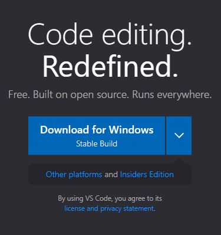
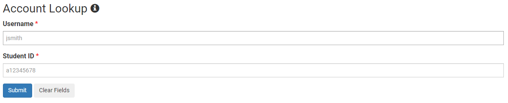
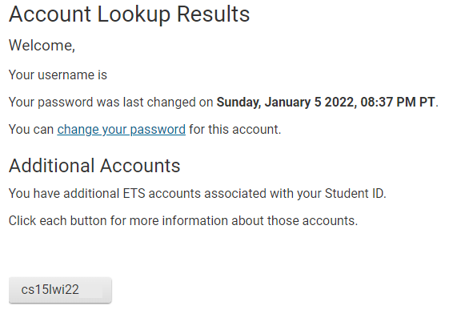
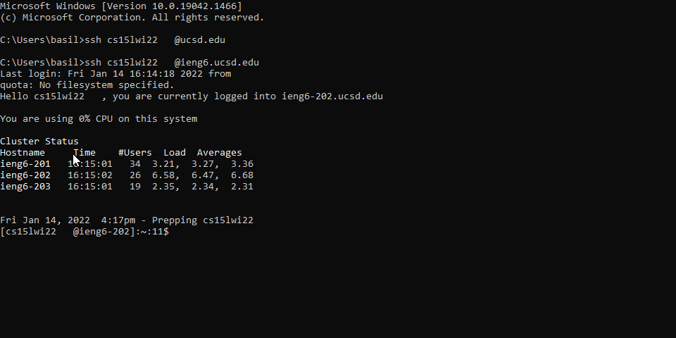
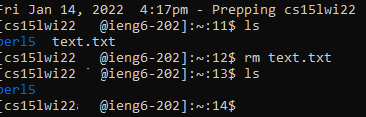
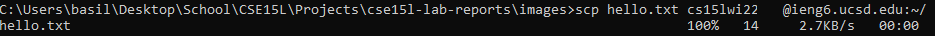
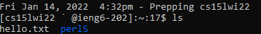
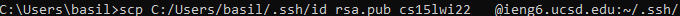
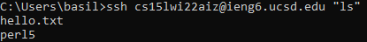
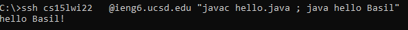

# Lab Report 1
**Week 1-2**

*by Basil Thaddeus*

[Home](https://basilthaddeus.github.io/cse15l-lab-reports/) > [Lab Report 1](https://basilthaddeus.github.io/cse15l-lab-reports/lab-report-1-week-2.html)

[prev]() : [next](https://basilthaddeus.github.io/cse15l-lab-reports/lab-report-2-week-4.html)

---

# Installing VSCode

> What is VSCode?

`VSCode`, short for Visual Studio Code, is an Integrated Development Unit, used for programming. They often support multiple different programming languages.

---

To install `VSCode`, open the [Visual Studio website](https://code.visualstudio.com/). Click on the `Download for ...` button.



> In the image above, we see `Download for Windows`. Depending on the operating system of your computer, the text may change.

Once downloaded, open the file and follow the instructions to install Visual Code Studio.

---

# Logging into your account

> Why do we need our accounts?

Your account acts as an additional computer for you to access. On these computers, you can do course-specific work that may be more difficult to accomplish on your personal computer.

---

Open https://sdacs.ucsd.edu/~icc/index.php and enter your current student information into the `Account Lookup` section.



Click the `Submit` button. You will see a page that looks similar to the one 
below. 



You will now be able to see all your course-specific accounts. For this tutorial, we will be looking at the `CSE15L` course, although this can be used for other classes as well.

> Click the button that starts with `cs15lwi22...` The last 3 letters represent your unique account for the course. The image above has it blurred out. Note down or memorize the last 3 letters.

# SSH into your account

> What is SSH?

SSH is a protocol intended to allow you to access other computers around the world from your personal computer.

---

> WARNING: this tutorial is mainly intended for Windows, but is similar to the procedure for other operating systems.

Click the windows button and search for `Command Prompt`. Run the app and you'll be presented with your terminal. We're going to use the terminal to SSH into our lab computer.

In your terminal, type the following command:

```bash
ssh cs15lwi22***@ieng6.ucsd.edu
```

> Make sure to replace the *** with your 3 unique letters from the previous step.

A prompt will appear asking you to authenticate with the server. Type `Y` to continue.

Use the UCSD password you had decided on to login to the remote computer.

Once logged in, you will see a summary of the specific server you are connected to along with previous log-in attempts, similar to the image below.



# Commands to use

Some commands to use once you are connected include:

* ls (this displays the files in the folder you are currently in)
* mkdir (this creates a new folder in the folder you are in)
* rm -filename (removes a file in your current folder)



# Moving files

> You may want to move files from your personal computer to your server. We can do this using the `scp` command.

First, disconnect from your server by typing `logout`.

Once you are logged out, type the following commands:

```bash
cd Desktop
echo hello world > hello.txt
scp hello.txt cs15lwi22***@ieng6.ucsd.edu:~/
```

> Make sure to replace the *** with your 3 unique letters.

You will be prompted to enter your password once again. Once you've done so, you'll see a response stating that 1 file has been copied.



If we now decide to connect back to our server and type `ls`, we will see that our file has been moved. To make sure its the same file and has the same contents, we can type `nano hello.txt` to see the context of the file.



# Setting up an SSH Key

> What does an SSH Key do?

By creating an SSH key, we can remove the need of entering our password everytime we access our server. Not only is this easier, but also has security benefits.

---

To start, we want to log out of our server once again by typing `logout`. In our terminal, we want to type the following commands:

```bash
ssh-keygen
```

After typing this, we will receive an output that looks like:

```
Generating public/private rsa key pair.
Enter file in which to save the key (C:\Users\basil/.ssh/id_rsa):
Enter passphrase (empty for no passphrase):
Enter same passphrase again:
Your identification has been saved in C:\Users\basil/.ssh/id_rsa.
Your public key has been saved in C:\Users\basil/.ssh/id_rsa.pub.
The key fingerprint is:
SHA256:KmFkwh3lCA4T4r4ezfheEt9HwocP9V8MTb3TVKx6DBc basil@LAPTOP-H4B72E8K
The key's randomart image is:
+---[RSA 3072]----+
|=.. ...        o+|
|o= o +        E +|
| .+ = .  .   . =o|
|.  +  . o . . =o.|
| . .o  =So . = o.|
|  =.o...*   o +  |
| + +.o.. o   o   |
|. o o.  .        |
| ..o             |
+----[SHA256]-----+
```

For the most part, you will want to skip most of the customization and click enter. Once you have your ssh key generated, type the following commands to move them to your server.

```bash
ssh cs15lwi22***@ieng6.ucsd.edu
mkdir .ssh
logout
scp C:/Users/&&&/.ssh/id_rsa.pub cs15lwi22***@ieng6.ucsd.edu:~/.ssh/authorized_keys
```



> Make sure to replace the *** with your 3 unique letters and &&& with your username on your laptop.

Now, you should be able to ssh into your server without entering a password. Try it out!

# Make remote access more pleasant

Did you know you dont have to SSH into your server to run commands? Try these out!

```bash
ssh cs15lwi22***@ieng6.ucsd.edu "mkdir afolder"
ssh cs15lwi22***@ieng6.ucsd.edu "ls"
```



There are many more commands to experiment with, some can be found [here](https://www.educative.io/blog/bash-shell-command-cheat-sheet). Be careful not to type in commands that seem suspicious, they may cause damage to your system.

You may also run a java command remotely. Type the following command to run your java file which you have saved on the server.

```bash
ssh cs15lwi22***@ieng6.ucsd.edu "javac myfile.java ; java myfile"
```

Of course, you can simply manipulate the basic command if you would like to pass arguments to your java file. We can see the output of a basic hello world file below.

