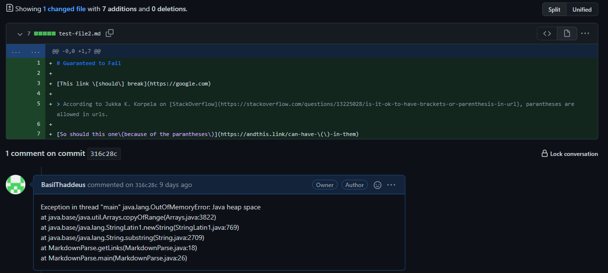
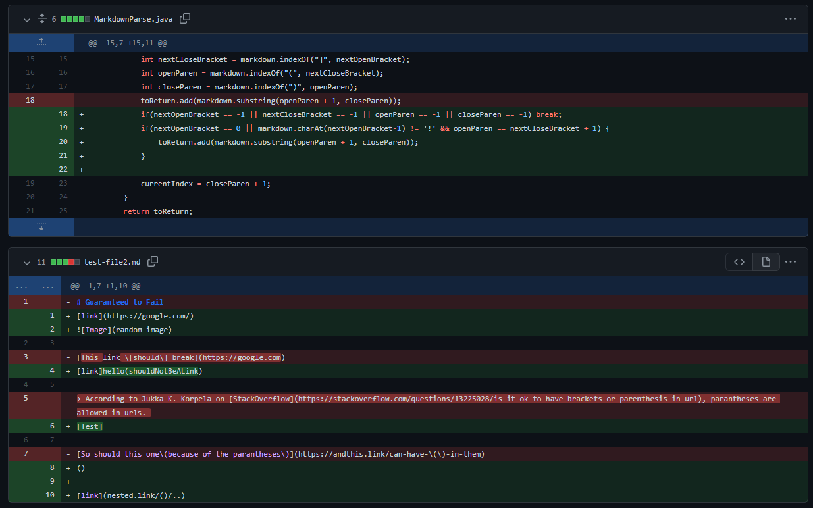
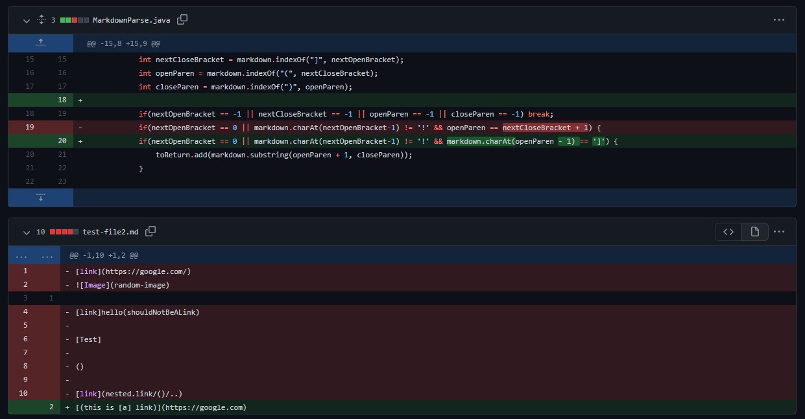

# Lab Report 2
**Week 3-4**

*by Basil Thaddeus*

---

# Debugging

> Why do we debug

Debugging is an important part of coding and making sure your program works as intended. As a result, it is important to also commit your changes and keep yourself up to date with what the issue was, and how you solved it. 

> What is the point of commiting

It is important for us to commit to our github often so that we can see what was fixed during each change of code. For example, if you just fixed a specific case of a bug, you want to be able to see what code you changed to fix the bug. This can also help in the long term when you need to come back.

---

# Examples of commits

## Commit #1



In our [first commit](https://github.com/BasilThaddeus/markdown-parse/commit/316c28cac2f35957a3c86f49b183c130d1072f79), we want to test and add our breaking tests. In the image above, we can see the `test-file2.md` being edited to add new lines which are meant to break the code. Below that, in the comments on the commit, we can see the exact error we ran into. 

> Generally, you do not want to add all your breaking cases at once. You should test each individually, figure out which one is causing the error, and then fix your issue. The image above does not show the best practice.

The symptom which we received was an exception being thrown. The exception is thrown because our code was infinitely adding results to our toReturn list, causing the java program to run out of memory.

Our output when running the program in this state was:

```bash
C:\javac MarkdownParse.java

C:\java MarkdownParse test-file2.md

C:\ Exception in thread "main" java.lang.OutOfMemoryError: Java heap space
at java.base/java.util.Arrays.copyOfRange(Arrays.java:3822)
at java.base/java.lang.StringLatin1.newString(StringLatin1.java:769)
at java.base/java.lang.String.substring(String.java:2709)
at MarkdownParse.getLinks(MarkdownParse.java:18)
at MarkdownParse.main(MarkdownParse.java:26)
```

## Commit #2



In our [second commit](https://github.com/BasilThaddeus/markdown-parse/commit/48ca5caa57727fb3dff3fe2a58e64b00a2fad15c), our goal was to fix the bugs which had been caused by the first commit. We added new lines to the `MarkdownParse.java` file which caused the while loop to `break` whenever we could not find one of the open or close params for the brackets and parentheses. This caused the java heap error to stop.

Additionally, as observed in line 19, we added a way to recognize links from images by checking if there is a `!` before the first open bracket. This was a preventive way of programming, as this issue would have occured at some point in the programming process.

Nonetheless, we still had issues with our output. When this line was added, we'd receive the wrong output:

```bash
*** Our MD File ***
[link](nested.link/()/..)

*** Terminal ***
C:\javac MarkdownParse.java

C:\java MarkdownParse test-file2.md
[..., "nested.link/("]
```

The link for `nested.link` was incorrect as it was meant to output `nested.link/()/..`, a case which caused the program to fail. This was a symptom to another bug we had to fix.

## Commit 3



In our [third and final commit](https://github.com/BasilThaddeus/markdown-parse/commit/f0f3a6c6099d65edc6b3d20ae340dc3da5a5e938), we started finalizing on our code more. Although, as a class, we were unable to solve the issue of nested parantheses in links, we were able to fix some problems caused by text being included in between links.

For example, `[link] foo (google.com)` should not return any link as it is not a valid hyperlink. To prevent this, we added a link of code that would check if the character before our open parantheses `(` was the closed bracket `]`. This another bug we had in our code.

As a result, our output went from

```bash
C:\javac MarkdownParse.java

C:\java MarkdownParse test-file2.md
["google.com"]
```

to

```bash
C:\javac MarkdownParse.java

C:\java MarkdownParse test-file2.md
[]
```

which represents the correct output.