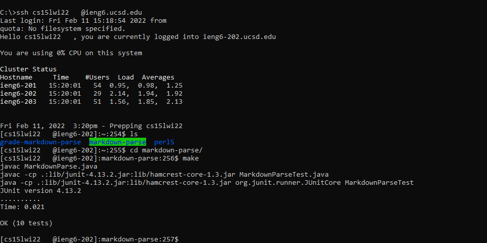

# Lab Report 3
**Week 5-6**

*by Basil Thaddeus*

[Home](https://basilthaddeus.github.io/cse15l-lab-reports/) > [Lab Report 3](https://basilthaddeus.github.io/cse15l-lab-reports/lab-report-3-week-6.html)

[prev](https://basilthaddeus.github.io/cse15l-lab-reports/lab-report-2-week-4.html) : [next]()

---

# Copying Whole Directories

> Why do we need to copy whole directories?

You may want to test some of your locally-written code on a different machine but you do not want to upload your changes in code to GitHub. In this scenario, copying entire directories may help.

## Step 1

Navigate and enter the directory which you will be copying over to your `ieng6` account. Once you are there, you can use one of the following options to copy over your directory.

Option 1
```bash
cd ..
scp -r [directory name]  cs15lwi22***@ieng6.ucsd.edu:~/
```

Option 2
```bash
scp -r . cs15lwi22***@ieng6.ucsd.edu:~/[new directory name]
```

Although these two options have the same result, they have two different purposes. Example 1 copies the entire directory, including the `directory name`, into your server. Example 2, on the other hand, copies all the contents of the directory while allowing you to choose a `new directory name`. Both options work well.


To check if our files successfully uploaded, we can log back into our server account and check our main directory.



# Streamline Copying and Connecting

We can streamline our task of both copying the directory and connecting to the server very easily. To do this, we can combine our connecting and copying commands into one line, as shown below

```bash
scp -r . cs15lwi22***@ieng6.ucsd.edu:~/markdown-parse & ssh cs15lwi22***@ieng6.ucsd.edu
```

This command works for windows. In the case of Linux or Mac, you may want to replace the `&` with a `;`.