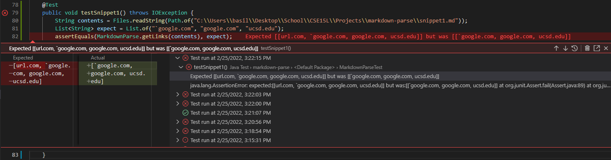
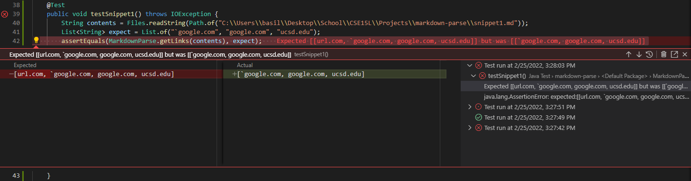
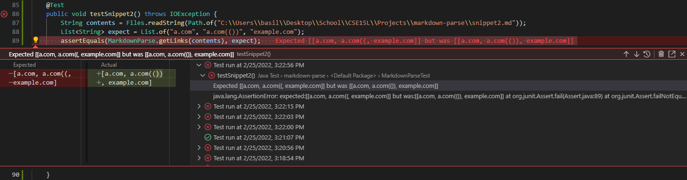
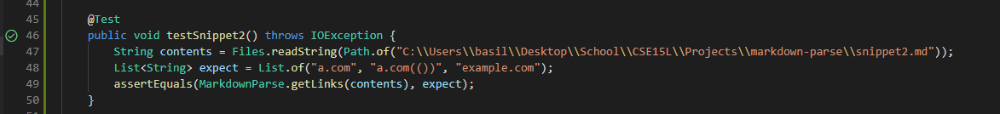
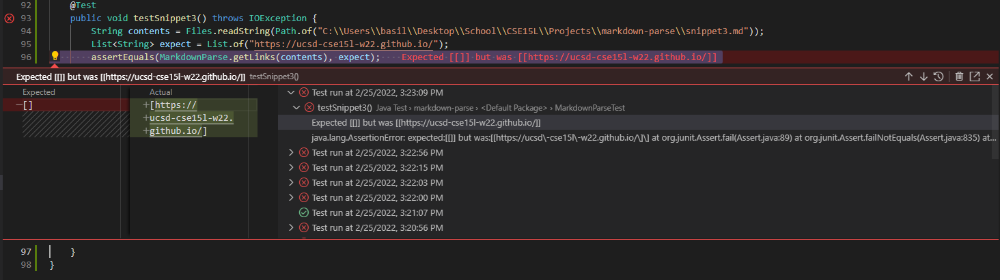
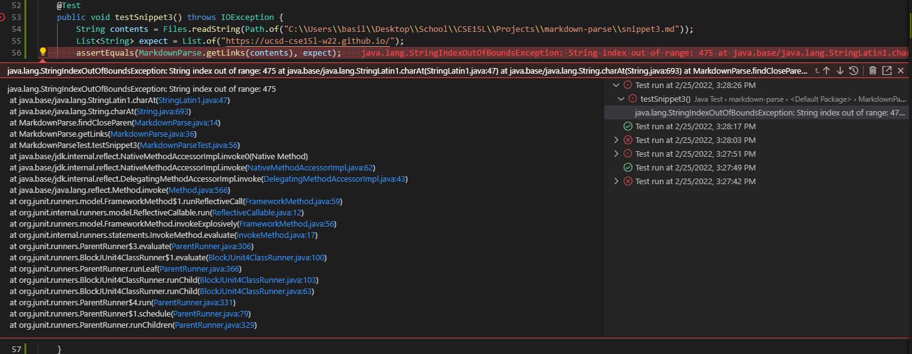

# Lab Report 4
**Weeks 7-8**

*by Basil Thaddeus*

[Home](https://basilthaddeus.github.io/cse15l-lab-reports/) > [Lab Report 4](https://basilthaddeus.github.io/cse15l-lab-reports/lab-report-4-week-8.html)

[prev](https://basilthaddeus.github.io/cse15l-lab-reports/lab-report-3-week-6.html) : [next](https://basilthaddeus.github.io/cse15l-lab-reports/lab-report-5-week-10.html)

---

# Running Tests on Different Implementations

The 2 different implementations we'll be running our tests on will be the [local](https://github.com/BasilThaddeus/markdown-parse) implementation and [the professors](https://github.com/ucsd-cse15l-w22/markdown-parse) implementation. 

After cloning both repo's into our local machine, we can start by looking at the provided snippets.

# Provided Snippets

We are provided these 3 snippets:

```md
`[a link`](url.com)

[another link](`google.com)`

[`cod[e`](google.com)

[`code]`](ucsd.edu)
```
```md
[a [nested link](a.com)](b.com)

[a nested parenthesized url](a.com(()))

[some escaped \[ brackets \]](example.com)
```
```md
[this title text is really long and takes up more than 
one line

and has some line breaks](
    https://www.twitter.com
)

[this title text is really long and takes up more than 
one line](
    https://ucsd-cse15l-w22.github.io/
)


[this link doesn't have a closing parenthesis](github.com

And there's still some more text after that.

[this link doesn't have a closing parenthesis for a while](https://cse.ucsd.edu/


)

And then there's more text
```

First, lets figure out each snippets working links. 

## Snippet 1

---

`[a link`](url.com)

[another link](`google.com)`

[`cod[e`](google.com)

[`code]`](ucsd.edu)

---

Everything except for the first looks like a link. We can conclude that the expected output should be
```
`google.com, google.com, ucsd.edu`
```

When compiling tests on our local machine, we see that the output has a conflict with our expected output. 



Lets try re-running this one Professor Politz's code.



It looks like we encounter the same issue, which leads us to understand that the code leading to this issue is shared between our local code and the professors.

## Snippet 2

---
[a [nested link](a.com)](b.com)

[a nested parenthesized url](a.com(()))

[some escaped \[ brackets \]](example.com)

---

Snippet 2 has a different output, with some nested links. From the above, we can assume that the links are

```
a.com, a.com(()), example.com
```

When we run the code on our local machine, we get the following result.



The test fails on our code. Lets try it on our secondary code.



This test passes on the other code. We can conclude that there is something that occurs in the second piece of code that results in a passing of the test.

## Snippet 3

---

[this title text is really long and takes up more than 
one line

and has some line breaks](
    https://www.twitter.com
)

[this title text is really long and takes up more than 
one line](
    https://ucsd-cse15l-w22.github.io/
)


[this link doesn't have a closing parenthesis](github.com

And there's still some more text after that.

[this link doesn't have a closing parenthesis for a while](https://cse.ucsd.edu/


)

And then there's more text

---

The above case is interesting because it has a couple hyperlinks that are the result of a link appearing. For example, `https://www.twitter.com` is not a link we created but the .md processor did.

The links that we should expect from the output are

```
https://ucsd-cse15l-w22.github.io/
```

Running the test on our local machine, we get the following result



We get an error of output on our code. When running it on the professors code, we get a different issue.



Here, we get a bug that is related to the written code in our `MarkdownParse.java` file.

# Conclusion

There are small differences within the code that we had previously written, along with the professors code that result in differences of output.