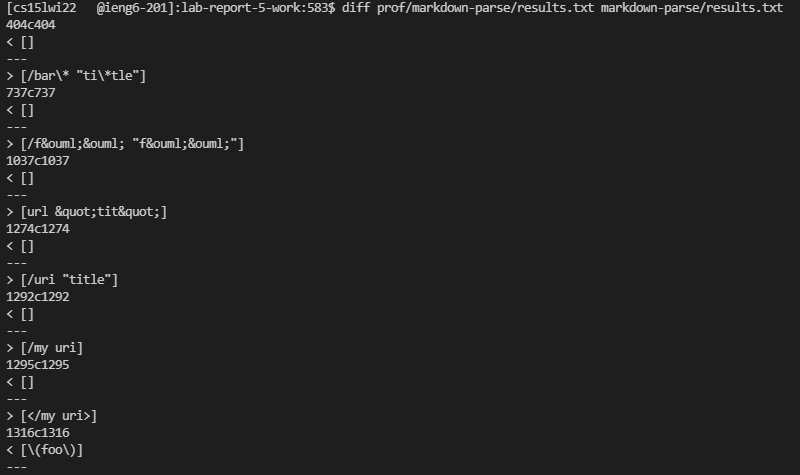

# Lab Report 3
**Weeks 9-10**

*by Basil Thaddeus*

[Home](https://basilthaddeus.github.io/cse15l-lab-reports/) > [Lab Report 5](https://basilthaddeus.github.io/cse15l-lab-reports/lab-report-5-week-10.html)

[prev](https://basilthaddeus.github.io/cse15l-lab-reports/lab-report-4-week-8.html) : [next]()

---

# Finding differences between implementations

For this lab report, we're going to look at the differences between different implementations and their results. We'll be looking at two different implementations, shortened to `prof` and `local` representing the proffessors code and our local machines code respectively.

In order to compare our differences in code, we first took the output of each implementation and put it into a text file called results.txt in seperate folders. The code we used to do this was

```bash
bash script.sh > results.txt
```

The `>` writes the output of the bash script into the file, overwriting any previous content. You may want to use `>>` if you are trying to add to the file instead. For our implementation, we want the most accurate and up to date info stored in the `results.txt`.

With both of our results saved in their respective folders, we can run a command built into linux that compares different files. First, navigate to the parent directory. Our file system looks like the following:

```
home (we are here)
    > prof
        > markdown-parse
            > ...
            > results.txt
    > markdown-parse (represents local)
        > ...
        > results.txt
```

Once we are in our home directory, we can run the following command

```bash
diff prof/markdown-parse/results.txt markdown-parse/results.txt
```

We receive the following output



Lets look at our output!

The first line that we can identify is `404c404`. Lets break down what this represents. `404` represents the location where a change is noticed. If we go into our `results.txt`, we can find that the error occurs in test file `22.md`. 

We notice this because our bash script `script.sh` was set up to echo the name of the file along with its results.

Looking at file 22.md, we see the contents of `[foo](/bar\* "ti\*tle")`. When we look at this in our md file, we can see that it is a link.

---
[foo](/bar\* "ti\*tle")

---

Looking back at the output, we notice that there are `<` and `>` which represent left and right respectively. This means that the left results.txt, from the `prof` implementation, resulted in an output of `[]` while the local implementation resulted in `/bar\* "ti\*tle"`. We can determine that the local implementation was the more correct one in this case as it corectly identified this as a link.

Next, lets look at the output of `737c737`. It looks like this identifies that test file `32.md` has an issue. Looking at the contents of test file `32.md`, we see that it contains `[foo](/f&ouml;&ouml; "f&ouml;&ouml;")`. Lets see if this identifies as a link on markdown.

---
[foo](/f&ouml;&ouml; "f&ouml;&ouml;")

---

From the above, we can see that it did identify as a link. It seems that the implementation in the folder `prof` missed this link once again, while the implementation in the local one did not.

# Analyzing our findings

The results we looked at above do not signify that the local implementation is correct while the proffessors implementation is incorrect. It only states that the local implementation was able to locate and find some links that the `prof` implementation was not able to do. The same could occur with the `prof` implementation finding content that the `local` could not. More tests would need to be analyzed to fully understand the capabilities of both.